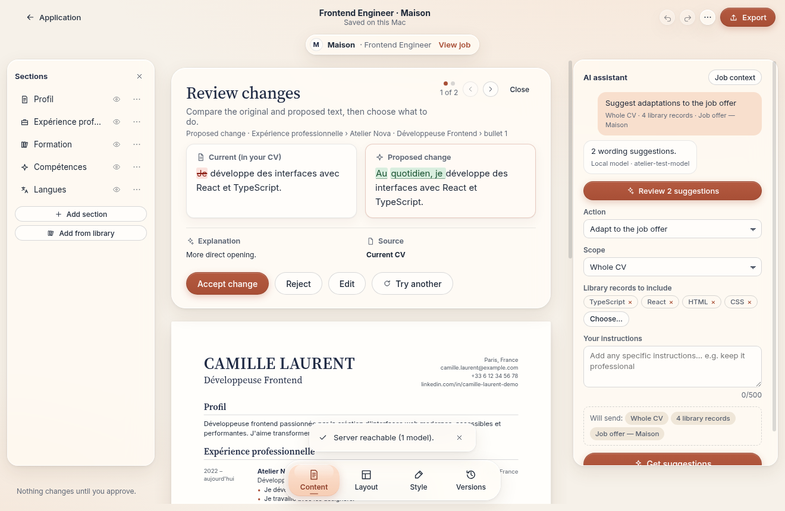

# Atelier

Aplicación personal para macOS (Apple Silicon) para gestionar tu biblioteca profesional, adaptar CV a ofertas con IA revisando cada cambio, y conservar cada candidatura con la versión exacta que enviaste. Todo se guarda en tu Mac.

## Instalador

- **Descarga**: borrador de *release* **«Atelier — latest build»** del repositorio (`Atelier-1.0.0-arm64-mac.dmg` y `.zip`), generado y probado por la CI en un Mac con Apple Silicon. También está como artefacto *Atelier-macOS-arm64* de cada ejecución del flujo *macOS build, test and package*.
- **Requisitos**: Apple Silicon, macOS 13 Ventura o posterior. No requiere Node ni Python.
- **Firma**: ad hoc. **No** firmada con Developer ID **ni notarizada** (no había credenciales de Apple). La primera apertura pide confirmación: ver [docs/GUIA.md § 3](docs/GUIA.md#3-primer-arranque-aviso-de-seguridad-de-macos).

## Documentación

| | |
|---|---|
| [docs/GUIA.md](docs/GUIA.md) | Guía breve: instalar, abrir, importar, conectar IA, adaptar, exportar, copia de seguridad |
| [docs/BUILD.md](docs/BUILD.md) | Compilar, probar y empaquetar de forma reproducible |
| [docs/TESTING.md](docs/TESTING.md) | Estrategia de pruebas y política de cobertura |
| [docs/TEST-REPORT.md](docs/TEST-REPORT.md) | Resultados reales: pruebas, cobertura, prueba del paquete, entornos, límites |
| [docs/DECISIONS.md](docs/DECISIONS.md) | Decisiones (ADR), investigación de proveedores de IA y límites conocidos |
| [docs/screenshots/](docs/screenshots/) | Capturas de las pantallas y de un PDF exportado |

## En resumen

- **Biblioteca**: importa varios DOCX, PDF (también escaneados, con OCR local) y Pages; conserva los originales; revisa lo extraído; resuelve cada diferencia entre documentos; cada dato recuerda su origen.
- **Candidaturas**: oferta por texto, enlace o archivo; tablero por estados; expediente con oferta, notas, historial, conversaciones y archivos enviados. «Mark as sent» congela la versión y los archivos exactos.
- **Editor**: edición directa con deshacer/rehacer y guardado automático; plantillas *Classic*, *Sidebar* y *Compact*; secciones movibles con ratón o teclado; estilo; A4 multipágina sin reducir nunca el texto; exportación PDF y Word.
- **IA bajo control**: ChatGPT (plan), OpenAI API, Claude API o modelo local; solo bajo petición; cada cambio es una propuesta revisable; nada inventado sin tu confirmación; nunca cambia sola de proveedor ni a una modalidad de pago.
- **Privacidad**: datos locales, secretos en el llavero de macOS, sin telemetría, copia de seguridad en un único archivo.
